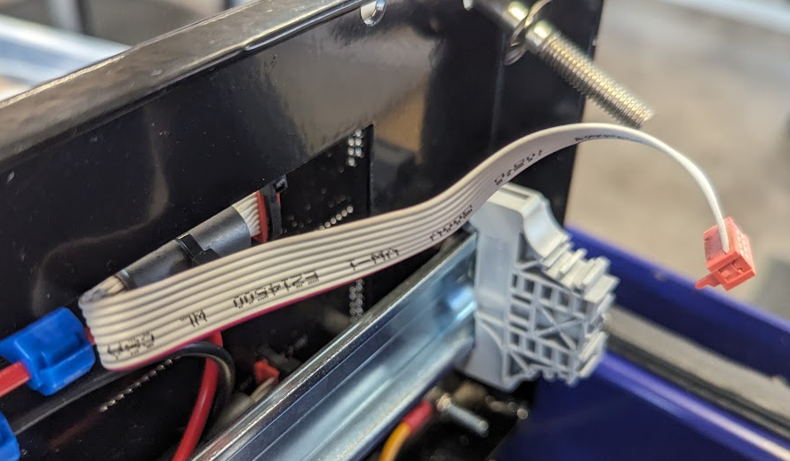
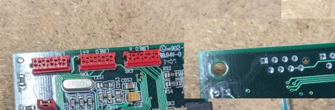

# Archive

Contains outdated information from other markdown files. For posterity?

## unit as a whole

i.e., with Ethernet cable, and hacking Ethernet commands

I imagine I'd need to [Wireshark](https://www.wireshark.org/) the Ethernet signals, and try and pretend to be the server. This might be difficult.

## to-do

Find out which wires on the aforementioned ribbon cable correspond to which entry above...

...and then trace them through the PCB...

...and solder on some jumper cables, which I can put into a breadboard.

Then, attach the breadboard to the Pi, and can use the pinouts to (hopefully) use the lights!
