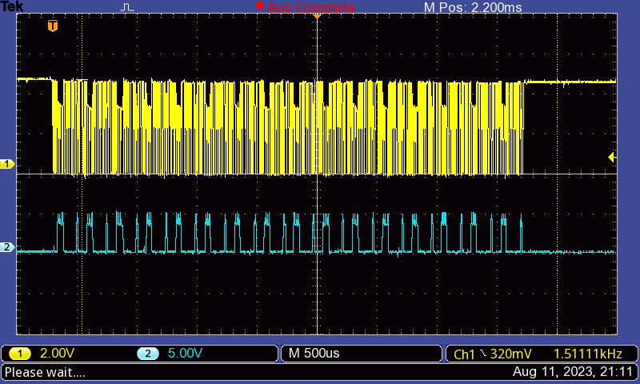

# Code information

Code taken from <https://github.com/ConnectedHumber/Bus-Terminal-Signs/>

## Code

### `Scrolling Text Demo.ino`

demo of scrolling text

For the default code, ConnectedHumber used 2 PCBs, amounting to a 6x2 array of panels, or 12 "chips" (2 chips per panel).

<https://github.com/ConnectedHumber/Bus-Terminal-Signs/blob/master/Code/Examples/Scrolling%20Text%20Demo.ino>

### `CH_AS1100.h`

description of class (which you have to inherit from):

<https://github.com/ConnectedHumber/Bus-Terminal-Signs/blob/master/Code/CH_AS1100.h>

### `CH_AS1100.cpp`

C++ code which inherits from class (to implement working behaviour):

<https://github.com/ConnectedHumber/Bus-Terminal-Signs/blob/master/Code/CH_AS1100.cpp>

## Information

- There are three pins of interest:
  - load
  - clk (clock)
  - data
- When changing pixels (with e.g., [`setPixel`]), it changes only the [internal pixel array].

  You must call [`Panel.display`] to update the pixels.
  This calls `sendPixels`, which:

  - calls `writeDigit` for each pixel
    - calls `write16`
      - writes to data pin (sends "the lower 12 bits of the word" - not sure what this means. I think it is leftover from copied code, and it actually just sends 0 or 1 (on or off))
  - calls `load`, which writes to load pin. "load pulse causes data to be loaded and displayed if display is on"

[`setPixel`]: https://github.com/ConnectedHumber/Bus-Terminal-Signs/blob/924d6c9f16a497d58154f33e4dc9a63ff28e7344/Code/CH_AS1100.cpp#L390-L404
[internal pixel array]: https://github.com/ConnectedHumber/Bus-Terminal-Signs/blob/924d6c9f16a497d58154f33e4dc9a63ff28e7344/Code/CH_AS1100.h#L67
[`Panel.display`]: https://github.com/ConnectedHumber/Bus-Terminal-Signs/blob/924d6c9f16a497d58154f33e4dc9a63ff28e7344/Code/Examples/Scrolling%20Text%20Demo.ino#L71

## SPI and Sending Data

To communicate with the AS1100, SPI can be used. The communication method is described in the [AS1100 datasheet].

The [current code uses "bit banging"][bit banging] to attempt to communicate with the AS1100 boards. Partly to understand SPI, and partly to diagnose issues, I have scoped into the clock, data, and load pins to see exactly what signals are sent when data is sent.

### Setup

For this experiment, I use the following Arduino script to repeatedly send a basic command to the AS1100 to reset the clock.

```c
#define DATA_PIN 5
#define CLK_PIN 9
#define LOAD_PIN 10

#define NUM_CHIPS 16

Panel panel=Panel(DATA_PIN,CLK_PIN,LOAD_PIN,NUM_CHIPS);

void setup() {

}

void loop()
{
  panel.setClockMode(2);
  delay(100);
}
```

As per the [definition of setClockMode][setClockMode], this sends `0x0E02`, or

```binary
0000 1110 0000 0010
```

As per the [AS1100 datasheet], it accepts 16 bits as such...


...and specifically for the clock modes, it accepts `0x0E00`, `0x0E01`, `0x0E02`, `0x0E03`:


[setClockMode]: https://github.com/ConnectedHumber/Bus-Terminal-Signs/blob/e6338adccdb4e44680c86468fa18fadd92395694/Code/CH_AS1100.cpp#L486-L495
[bit banging]: https://github.com/ConnectedHumber/Bus-Terminal-Signs/blob/master/Code/README.md
[AS1100 datasheet]: https://github.com/ConnectedHumber/Bus-Terminal-Signs/blob/master/Datasheets/AS1100_DS000273_1-00.pdf

### How the code sends data

The code sends the signal (`0000 1110 0000 0010`) by sending `write16(0x0e02)` followed by `load()` ([source][sendCmd])

```c++
void Panel::setClockMode(int m)
{
  sendCmd(0x0E00 + (m & 3));
}
```

In my case, this for loop repeats 16 times as I told it I have 16 chips.

```c++
void Panel::sendCmd(int data)
{
  // workhorse for many register updates below
  // only used when all registers need to contain the same value
  for (int chip = 0; chip < _numChips; chip++)
    write16(data);
  load();
}
```

[write16 source][write16]

`NEXT_PULSE_DELAY` is 1 ms.

```c++
void Panel::write16(int d)
{
  // first 4 bits are don't care so we send zeros
  // caller must call load() if this is the last write16
  int mask = 0x0800;
  digitalWrite(_dataPin, LOW); // send leading 0b0000
  delayMicroseconds(1);
  clk();
  clk();
  clk();
  clk();
  // then the lower 12 bits of the word
  for (int i = 0; i < 12; i++)
  {
    digitalWrite(_dataPin, (d & mask) > 0 ? HIGH : LOW);
    delayMicroseconds(NEXT_PULSE_DELAY); // allow data to settle
    clk();
    mask >>= 1;
  }
  digitalWrite(_dataPin, LOW); // end WITH 0 - EASIER TO DEBUG
}
```

```c++
void Panel::load()
{
  // load pulse causes data to be loaded and displayed if display is on
  digitalWrite(_loadPin, LOW); // transfer from shift register to display drivers buffer
  delayMicroseconds(LOAD_PULSE_WIDTH);
  digitalWrite(_loadPin, HIGH);
  delayMicroseconds(NEXT_PULSE_DELAY);
}
```

This is based on the specification in the [AS1100 datasheet]:


Notably:

- "The data is shifted into the
internal 16 Bit register with the **rising edge of the CLK signal**"
- "With the **rising edge of the LOAD signal** the data is latched into a digital or control
register depending on the address. "

[sendCmd]: https://github.com/ConnectedHumber/Bus-Terminal-Signs/blob/e6338adccdb4e44680c86468fa18fadd92395694/Code/CH_AS1100.cpp#L477-L484
[write16]: https://github.com/ConnectedHumber/Bus-Terminal-Signs/blob/e6338adccdb4e44680c86468fa18fadd92395694/Code/CH_AS1100.cpp#L216-L236

### Oscilloscope

Here the oscilloscope is connected to pin 9 (clock) on channel 1, and pin 5 (data) on channel 2.


#### Sending 0x0E02, clock and data

Here you can see the clock signal (1, yellow), and the data signal (2, blue). The signal is sent 16 times repeatedly, as per the code above (`sendCmd`).



Let's zoom on one single message (plotted with [`plot_single_message.py`](./oscilloscope/plot_single_message.py)), remembering that the bytes being sent are:

```binary
0000 1110 0000 0010
```


Neat! That looks good. It also looks like we are on the limit of this timestep's resolution. We could look again by increasing the oscilloscope timestep, but it wouldn't catch the whole signal (above). This wouldn't be an issue as we only want one signal (16 bits).

Also, it seems that the peak signal is around 3.3 V. This may be a problem, [as mentioned by ConnectedHumber][arduino driving].

[arduino driving]: https://github.com/ConnectedHumber/Bus-Terminal-Signs/blob/master/Hardware.md#using-an-arduino-to-drive-the-panels

#### Sending 0x0E02, clock and load

As described above, the load signal goes high (by going low, then high), triggering the previous 16 bits to be read.


Zoom:


It may make more sense for the load pin to be low all the time, and go high when it needs sending. This may be more reliable.
