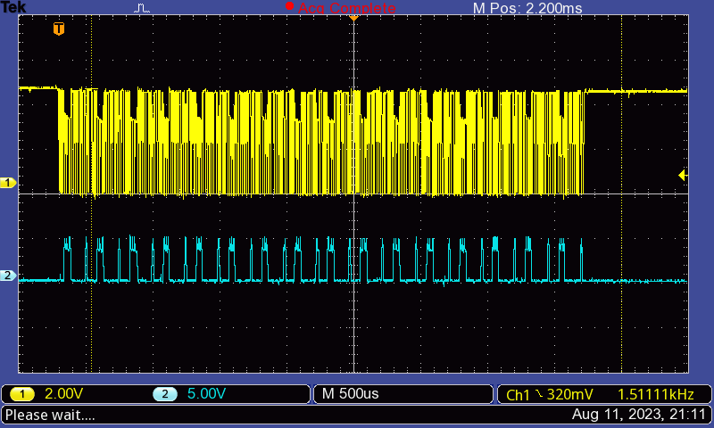
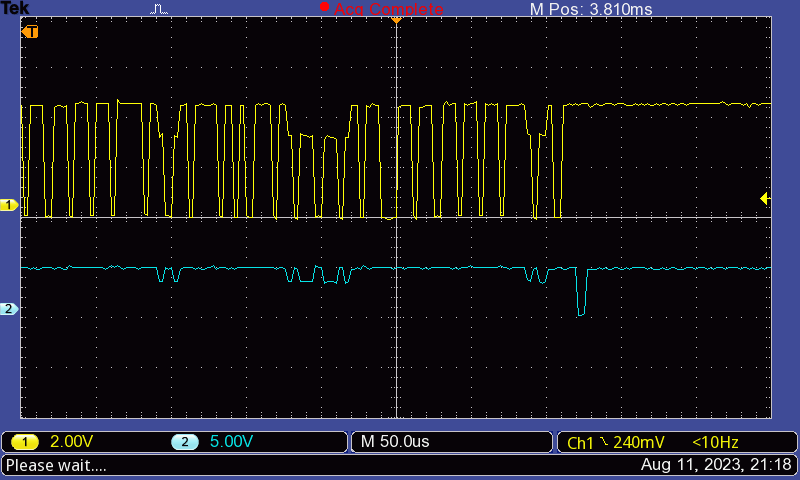
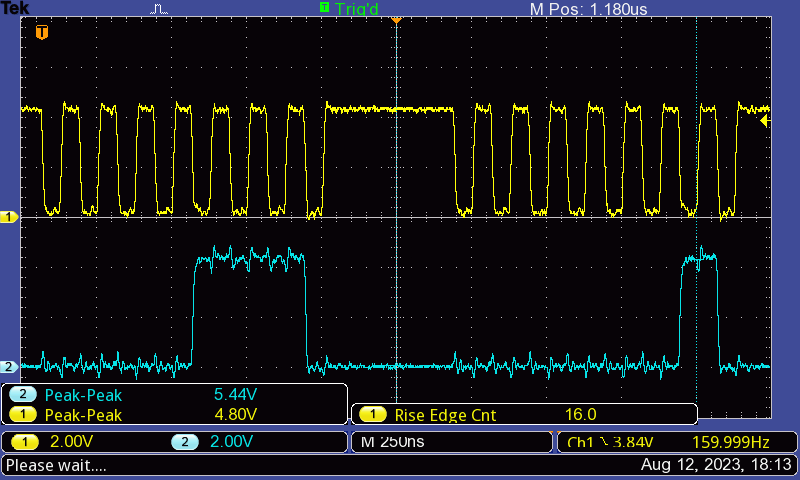
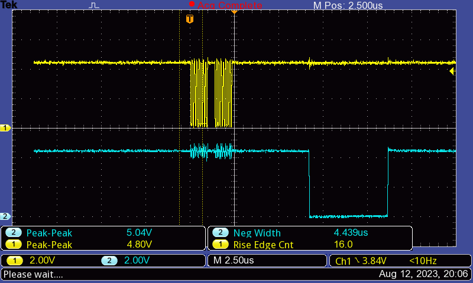

# Oscilloscope

Saved traces from the oscilloscope.

## send-0x0e00_1-clock_2-data_0

[ConnectedHumber]'s code for sending `0x0e02` (typo in filename). See [code information]

Clock (top, yellow), and data (bottom, blue) pins.

## send-0x0e00_1-clock_2-load_0

[ConnectedHumber]'s code for sending `0x0e02` (typo in filename). See [code information]

Clock (top, yellow), and load (bottom, blue) pins.

## send-0x0e00_1-clock_2-load_1

[ConnectedHumber]'s code for sending `0x0e02` (typo in filename). See [code information]

Clock (top, yellow), and load (bottom, blue) pins.

## SPI-0x0e02_1-clock_2-data_0

See [SPI page](../SPI/README.md).

[code information]: ../code%20information.md#sending-0x0e02-clock-and-data
[ConnectedHumber]: https://github.com/connectedHumber/bus-Terminal-Signs/

## SPI-0x0f01_1-clock_2-load_0

SPI signal sending `0x0f01`. Clock signal shown in yellow. Load signal shown in blue.

