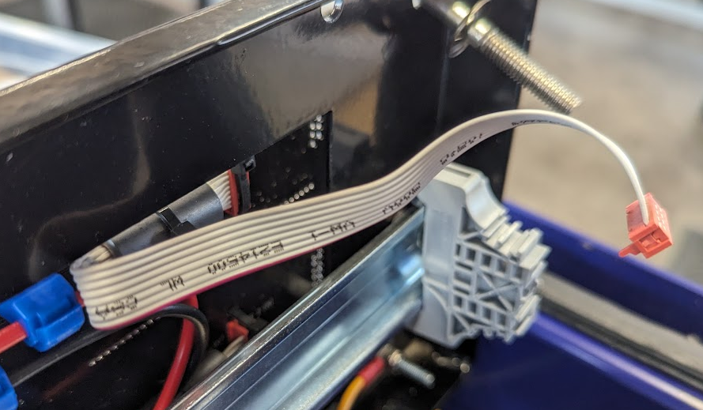

# To-do

## POWER

The LED boards need power. The unit already has this, from mains to a transformer (see [this image](https://github.com/ConnectedHumber/Bus-Terminal-Signs/blob/master/Hardware.md#control-modules))


Alternatively, we can attach to the red + black wires with our own 5V source. n.b., it is -5V to +5V (not 0V to 5V).

## CONNECTION

Either connect to:

### unit as a whole

i.e., with Ethernet cable, and hacking Ethernet commands

I imagine I'd need to [Wireshark](https://www.wireshark.org/) the Ethernet signals, and try and pretend to be the server. This might be difficult.

### led controller(s)

i.e., with attaching ribbon cable to some GPIO pins

This is what is done by [ConnectedHumber]. Pins are defined ([source][ConnectedHumber:pins])...

```c
// just 3 digital ports to control. Any you see fit will do - bit banged
#define DATA_PIN 25
#define CLK_PIN 26
#define LOAD_PIN 27
```

...and attached to the three corresponding cables in the 8-wire ribbon cable ([source][ConnectedHumber:ribbon])...


[ConnectedHumber]: https://github.com/ConnectedHumber/Bus-Terminal-Signs/blob/master/Hardware.md#control-modules
[ConnectedHumber:ribbon]: https://github.com/ConnectedHumber/Bus-Terminal-Signs/blob/master/Hardware.md#ribbon-cable
[ConnectedHumber:pins]: https://github.com/ConnectedHumber/Bus-Terminal-Signs/blob/924d6c9f16a497d58154f33e4dc9a63ff28e7344/Code/Examples/Scrolling%20Text%20Demo.ino#L10-L13

...and the signal on these pins is bit-bashed (pretending to be SPI). For code information (i.e., logic on what happens when you send "change a pixel"), see [code information](./code%20information.md#Information)

#### to-do

Find out which wires on the aforementioned ribbon cable correspond to which entry above...



...and then trace them through the PCB...


...and solder on some jumper cables, which I can put into a breadboard.

Then, attach the breadboard to the Pi, and can use the pinouts to (hopefully) use the lights!
