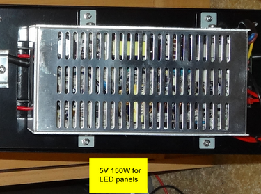
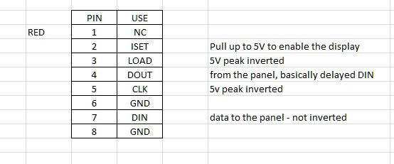

# Panel info

each individual panel is

24 x 9 pixels

the display as a whole is

8 x 2 panels
3 x 1 PCBs*

*these PCBs control multiple panels at once. The first two are 3x2 panels, the final is 2x2.

## POWER

The LED boards need power. The unit already has this, from mains to a transformer (see [this image](https://github.com/ConnectedHumber/Bus-Terminal-Signs/blob/master/Hardware.md#control-modules))



Alternatively, we can attach to the red + black wires with our own 5V source. n.b., it is -5V to +5V (not 0V to 5V).

## CONNECTION

by attaching ribbon cable to some GPIO pins

This is what is done by [ConnectedHumber]. Pins are defined ([source][ConnectedHumber:pins])...

```c
// just 3 digital ports to control. Any you see fit will do - bit banged
#define DATA_PIN 25
#define CLK_PIN 26
#define LOAD_PIN 27
```

...and attached to the three corresponding cables in the 8-wire ribbon cable ([source][ConnectedHumber:ribbon])...



[ConnectedHumber]: https://github.com/ConnectedHumber/Bus-Terminal-Signs/blob/master/Hardware.md#control-modules
[ConnectedHumber:ribbon]: https://github.com/ConnectedHumber/Bus-Terminal-Signs/blob/master/Hardware.md#ribbon-cable
[ConnectedHumber:pins]: https://github.com/ConnectedHumber/Bus-Terminal-Signs/blob/924d6c9f16a497d58154f33e4dc9a63ff28e7344/Code/Examples/Scrolling%20Text%20Demo.ino#L10-L13

...and the signal on these pins is bit-bashed (pretending to be SPI). For code information (i.e., logic on what happens when you send "change a pixel"), see [code information](./code%20information.md#Information)

### AS1100

The AS1100 board is used to control the matrix displays (8x8 or maybe 6x8 grids), as per this image (from [AS1100 datasheet](https://github.com/ConnectedHumber/Bus-Terminal-Signs/blob/master/Datasheets/AS1100_DS000273_1-00.pdf))


### Pins

On the multiple line DMX board, the pins going to the LED panels are as such:


